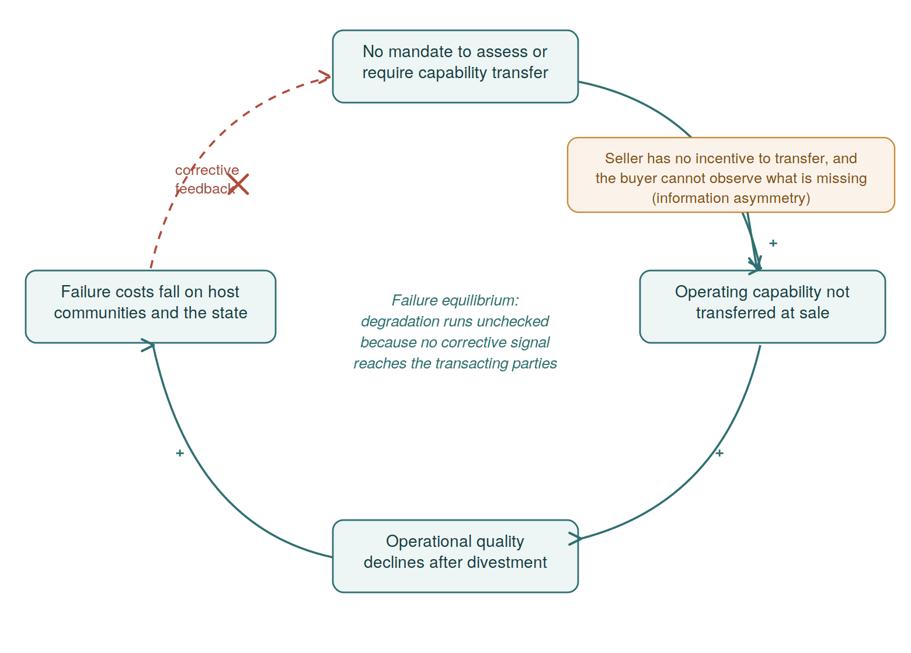

# Chapter 2

# Theoretical Foundation

## 2.1 Introduction

The transfer of upstream petroleum assets from international to domestic operators in Nigeria between 2010 and 2024 produced sharply differentiated outcomes. While some acquirers grew production and maintained operational integrity, others experienced severe safety failures, environmental disasters, or in some cases, organizational collapse. Across the divested operators, aggregate production rose marginally while operational quality declined. Why the split? Five explanations have been proposed, but none has been tested against the others using the full range of observed outcomes.

The analytical framework developed here tests whether the differentiated outcomes reflect a system-theoretic failure in the institutional design of the divestment process, or whether simpler, single-factor explanations account for them. Five competing explanations are examined: capital constraints, fiscal regime effects, regulatory inadequacy, political economy, and capability-related factors. Each is grounded in a distinct intellectual tradition, generates testable predictions about what should be observable in the evidence, and has conditions under which the evidence would reject it.

The five explanations enter the analysis with the same structure and falsification conditions. The evidence determines which explanation carries the most weight. The empirical investigation may find that several explanations are jointly operative, each accounting for a different dimension of the observed pattern, or that one explanation is most consistent with the evidence while others capture secondary effects. Where the evidence does not permit discrimination between two explanations, the analysis reports the ambiguity.

Coordination failure appears in every unsuccessful case, but the analytical question is whether it is an independent cause or a consequence of the deeper conditions the five explanations describe. Two cross-cutting conditions modify how the five explanations interact: information asymmetry, which explains why the capability gap persists without market self-correction, and absorptive capacity, which conditions whether a buyer can embed whatever capability is made available.

## 2.2 The Anatomy of an Upstream Asset Transaction

A divestment transaction transfers some components of an upstream petroleum operation and not others. The components that transfer and those that do not are where the five explanations disagree.

A typical IOC-operated onshore or shallow-water asset in the Niger Delta comprises wells drilled into multiple reservoir formations, connected by flowlines to gathering stations where crude oil is separated from water and gas. The crude is routed through trunk lines to export terminals, and loaded onto vessels for shipment. The physical infrastructure is substantial: wellheads, flowline networks, separators, compressors, tank farms, loading buoys, and associated electrical and instrumentation systems. Operating an asset of this scale requires sustained expenditure on maintenance, well intervention, corrosion management, community relations, security, and logistics.

What changes hands in a divestment transaction falls into three categories, and the five explanations disagree on which category matters most. Physical assets and legal rights transfer through the sale agreement: wells, flowlines, terminals, licenses, contracts, and associated infrastructure. Documented knowledge transfers through the data room: geological surveys, production records, engineering standards, maintenance logs, equipment specifications, and regulatory correspondence. Embedded organizational knowledge resides in forms whose transferability is contested: tacit operational practices accumulated through decades of operating specific equipment under specific conditions. These forms include crisis response judgment developed through experience with well control events and pipeline ruptures, and community relationships built through years of engagement with specific host communities. It also resides in organizational routines through which individual expertise is integrated into collective capability.

This third category is what distinguishes an operating asset from its hardware. A producing upstream asset is a sociotechnical system: the physical facilities and the operating organization that runs them form one working whole, and safe, productive operation is an emergent property of the coupling between them rather than a property of the equipment alone. The founding studies in this tradition showed that reorganizing the social arrangement of work degraded output even when the technology was unchanged (Trist and Bamforth, 1951). The same principle carries into contemporary systems engineering, where the social and technical elements of a system are designed and sustained together rather than separately (Baxter and Sommerville, 2011). The operational boundary of the asset therefore extends past the licensed hardware to the operating organization through which that hardware is run. A transaction that conveys the wells, the facilities, and the data room while leaving the operating organization behind divides the system along the interface between its technical and social subsystems, conveying the first and separating it from the second. What the transaction does not convey is the capability that emerged from that coupling. This thesis refers to that emergent capability as operating capability: the domain-specific knowledge of how a particular asset is run safely and productively. That knowledge is embedded in the operating workforce, the operating routines, the integrity and emergency systems, the structure of decision rights, the asset's data and history, and the contractor and technical-support architecture. It is specified element by element in Section 5.2. Whether an acquiring operator can reconstitute it, and within what period, is the question on which the competing explanations divide and which the evidence must settle.

The knowledge-based view of the firm explains why the social subsystem resists transfer through an arm's-length sale. The coordination mechanisms through which specialist knowledge is integrated into productive activity are specific to the organization that developed them (Grant, 1996; Kogut and Zander, 1992). Knowledge ranges from fully explicit to fully tacit, and the tacit portion resists codification (Nonaka, 1994). Organizational routines encode accumulated experience in patterns that guide behavior under both routine and non-routine conditions (Nelson and Winter, 1982). Multinational corporations act on this directly: they operate their foreign assets through wholly owned subsidiaries rather than licensing their technology, because the knowledge required to run those assets is too context-specific to move through arm's-length mechanisms (Kogut and Zander, 1993). A divestment is the arm's-length mechanism that this organizational form exists to avoid.

A quantitative analysis of 65 Nigerian oil and gas projects found that subsurface complexity and technology challenges were not the major causes of poor performance. Non-technical factors, including local content, community relations, security, and partnership dynamics, played a more significant role (Rui et al., 2018). If non-technical factors dominate performance outcomes in Nigerian upstream operations, then a concept of what transfers during a divestment that includes only physical assets and documented knowledge is incomplete.

This view of what transfers has a direct precedent in the enterprise architecture literature, which treats the organizational architecture as the enterprise that delivers value and the physical plant as only one element within it (Nightingale and Rhodes, 2015). On that reading, a divestment that conveys the plant while leaving the organizational architecture behind moves the hardware and strands the system that runs it. This is the same separation the sociotechnical tradition draws between a technical and a social subsystem (Trist and Bamforth, 1951). The process safety literature gives this abstraction operational content: the risk-based process safety framework specifies the management systems, competency programs, and operating discipline through which an organization holds a hazardous facility within safe bounds (CCPS, 2007). The inter-organizational transfer literature explains which of these elements degrade under which transfer conditions (Ferreira et al., 2024). The decommissioning literature closes the loop on cost: where an operator lacks the means to sustain these systems, the liabilities of late-life remediation and abandonment settle on host communities and the state ahead of the transacting parties (Stakeholder Democracy Network, 2022).

The five competing explanations disagree on which of these three categories is the binding constraint on post-divestment performance. Capital constraints treat physical assets plus financial resources as sufficient: a buyer with adequate funding can hire engineers, purchase training, and rebuild capability from documented sources. Fiscal regime effects point to the external fiscal environment, which degrades returns and makes previously viable investments uneconomic. Regulatory inadequacy locates the problem in the institutional framework, which does not assess whether embedded organizational knowledge transfers, permitting operators without it to acquire assets. Political economy argues that political connections can substitute for some components of embedded knowledge, particularly security management and community relations, though not for others. Capability-related factors predict that embedded organizational knowledge is non-substitutable within operationally relevant timeframes, and that its absence determines the quality outcome. Each is an empirical claim that the evidence must evaluate.

## 2.3 Five Competing Explanations

Each explanation that follows generates testable predictions, specifies observable evidence that would test them, and has conditions under which the evidence would reject it.

### 2.3.1 Capital Constraints

Indigenous operators may fail because they lack the financial resources to maintain the operational standard the IOC sustained. If this explanation is correct, financial capacity should correlate with operational outcome: better-funded operators should perform better, and operators with comparable financial resources should not diverge sharply on operational quality. Failure should manifest as progressive, cumulative degradation as the operator defers expenditures it cannot afford. If an operator fails suddenly in one domain while routine operations continue successfully, that pattern is inconsistent with capital constraints.

The mechanism producing this degradation is prioritized deferral. Operators with insufficient capital cut expenditures whose absence does not produce immediate visible consequences (HSE training, emergency preparedness, corrosion management, environmental monitoring) while maintaining expenditures whose absence produces immediate production loss (well intervention, flowline repairs, export terminal operations). Deferred maintenance accumulates, equipment degrades, contractor relationships deteriorate through payment delays, and qualified personnel leave for better-funded operators.

Resource dependency theory grounds this explanation: organizations depend on their external environment for critical resources, and the inability to secure those resources constrains organizational behavior (Pfeffer and Salancik, 1978). The pecking order theory of capital structure adds a prediction about the form the constraint takes: firms prefer internal financing over external debt, and external debt over equity, because information asymmetry between managers and external investors makes external financing more expensive (Myers and Majluf, 1984). For Nigerian indigenous operators without substantial retained earnings, the pecking order pushes them toward expensive debt, which constrains the operational investments the asset requires. Research on the capital structure of producing marginal fields in Nigeria found that both long-term and short-term debt had an inverse and significant impact on operator performance (Spiff et al., 2022). While Spiff et al. studied marginal fields (smaller, lower-capitalization operators), the direction of effect (debt constrains performance) is generalizable, though the magnitude may differ for the full-scale OMLs examined here.

The test therefore looks to the operator's financing structure at acquisition (deal records, corporate disclosures), production trajectory after acquisition (growth or decline), JV funding status (audit statements), and the sector-wide cost environment. Data presented at the NAPE pre-conference workshop show that Nigeria's operational expenditure is approximately 40 percent higher than comparable basins, with 30 to 50 percent capital project overruns, establishing that cost pressure is a system-level condition affecting all operators (Guardian Nigeria, November 2025).

Two conditions would reject capital constraints as sufficient. An operator that demonstrably funded sustained production growth but subsequently failed in a domain requiring organizational knowledge rather than capital expenditure would be inconsistent with capital as the binding constraint, because funding production growth demonstrates capital adequacy for major operational spending. An operator whose JV funding was maintained throughout a period of operational decline, confirmed by independent audit, would also reject the explanation for that case. A weaker but relevant condition is two operators with comparable financial resources producing divergent outcomes, which would weaken the prediction that capital determines performance.

High leverage may create financial fragility that constrains operational investment even when total capital appears adequate. The test is whether capital constraints, given observed funding levels and sector-wide cost conditions, best explain the pattern of variation across operators. If well-funded operators fail in specific domains while underfunded operators succeed, capital constraints cannot be the primary differentiating factor.

Capital may have been adequate in aggregate but deliberately sub-allocated away from emergency preparedness toward production growth. If the record indicates that the operator chose to underfund crisis readiness despite having resources, this is a management decision, not a problem of capital constraints. Capital constraints as an explanation require that the operator lacked the resources to fund both production and crisis preparedness simultaneously, not that the operator chose one over the other.

### 2.3.2 Fiscal Regime Effects

The Petroleum Industry Act, enacted on August 16, 2021, restructured Nigeria's upstream fiscal terms. The temporal relationship between the PIA and the observed failures is the first analytical constraint: the primary transactions examined here closed between 2010 and 2015, and the marginal field program failures between 2003 and 2020 predate the PIA entirely. The cause cannot postdate the effect.

Where the PIA could have effects on future transactions, the mechanism operates through the same deferral pathway as capital constraints but is triggered by external fiscal conditions rather than operator-specific financial weakness. Changed fiscal terms reduce net revenue per barrel, making previously viable operational investments uneconomic, and producing cumulative reduction in operational quality.

Fiscal regime design has measurable effects on operator behavior. Comparative analysis has found that Nigeria's fiscal terms under the PIA are regressive relative to comparable producing countries (Mohamed et al., 2024). The PIA reduced headline tax rates from 85 percent to 45 percent (comprising Hydrocarbon Tax of 15 percent and Company Income Tax of 30 percent), while introducing a cost-price ratio ceiling of 65 percent and new regulatory levies (Andersen, 2022). The direction and magnitude of the net fiscal effect on operator investment behavior depend on the specific asset and production profile.

If fiscal regime effects are the primary explanation, three patterns should be observable. A temporal break: operational outcomes for pre-PIA divestments should differ from post-PIA divestments. A uniform fiscal effect: all operators under the same fiscal regime should be affected similarly. And fiscal sensitivity: operational failures should correlate with fiscal pressure periods rather than with capability-specific events unrelated to investment deferral.

Here the evidence is the specific fiscal rates and their institutional implications for operator economics (Andersen, 2022; Nwuke, 2021); pre-PIA versus post-PIA operator performance comparisons; and the marginal field program outcomes, which unfolded entirely under pre-PIA fiscal terms. Operators who succeed under post-PIA terms while others fail under the same terms would weaken the uniform fiscal effect prediction.

Fiscal regime effects could, in principle, interact with operator-specific characteristics such as production profile or debt structure. For fiscal regime to be a primary explanation for differentiated outcomes, there would need to be evidence that the operators who failed were systematically more exposed to fiscal pressure than those who succeeded. The empirical analysis tests whether such systematic exposure exists.

The pre-PIA fiscal terms themselves also merit examination. The Joint Venture and Production Sharing Contract frameworks, royalty rates, and Petroleum Profits Tax that governed the observed period applied uniformly to all operators holding the same contract type. Cross-operator variation under those identical terms is inconsistent with fiscal regime as a sufficient explanation: if the fiscal terms are the same for everyone, they cannot explain why some operators failed and others succeeded. The empirical investigation focuses on the observed period, where pre-PIA and marginal field evidence dominates. Post-PIA cases are also examined for completeness, though the weight of evidence rests on the pre-PIA transactions and the marginal field precedent.

### 2.3.3 Regulatory Inadequacy

Weak regulatory oversight offers a different account of the pattern. This explanation locates the cause of post-divestment failure in the institutions responsible for overseeing asset transfers and monitoring operator performance, and contains two distinct mechanisms that generate different predictions and call for different interventions.

Design failure holds that the regulatory framework was structurally incomplete. It did not include operational capability assessment as a criterion for divestment approval. The mandate did not exist. The regulator assessed what the rules required, specifically financial capacity, legal compliance, and equity structure, and did not assess what the rules did not cover: embedded operational knowledge, crisis response capability, and organizational readiness. Institutional economics grounds this claim: institutions defined as the rules structuring human interaction determine the constraints within which organizations operate (North, 1990). If the rules do not require capability assessment, no amount of enforcement effort will produce it.

Execution failure holds that the regulator had the legal mandate and institutional framework to assess buyer capability but lacked the institutional capacity, resources, or political independence to exercise that mandate effectively. The rules existed on paper; they were not enforced in practice. Regulatory capture theory predicts that regulatory agencies in concentrated industries will come to serve the interests of the firms they regulate (Stigler, 1971).

The two sub-mechanisms generate different predictions. Under design failure, strengthening enforcement of existing rules would not improve outcomes, because the existing rules do not cover capability; only redesigning the framework would address the gap. Under execution failure, strengthening enforcement would improve outcomes, because the rules exist but are not applied. Both sub-mechanisms predict that cross-operator variation under the same regulatory framework should exist, because the regulation either permits variation by design or fails to prevent it through weak enforcement.

The record here is statutory: the Petroleum Act text (does Section 29 include capability criteria?), the PIA text (do Sections 232-233 mandate capability transfer assessment?). It also includes the NUPRC's institutional response to post-divestment failures (did it create new criteria or enforce existing ones more vigorously?), and cross-operator variation in outcomes under the same regulatory framework.

The NUPRC's response is diagnostically important. The Commission created a seven-pillar divestment framework in 2024 that it described as "established for the first time in the 68-year history of Nigeria's exploration and production" (NUPRC, 2024). It initially withheld consent on the ground that the consortium had not demonstrated the requisite technical capacity, before approving it after due diligence (The Energy Year, 2025; BusinessDay, 2025). These actions are consistent with design failure: the institution recognized that the framework was incomplete and created new assessment criteria, rather than enforcing existing ones more vigorously. The NUPRC's response is evidence that the design gap existed, not that the gap caused the specific failures observed. Establishing causation requires showing that the failures occurred in domains where capability assessment at the point of transaction would have identified the deficit and where the deficit was not compensable through post-acquisition market mechanisms. Both conditions are tested in the empirical analysis.

Regulatory inadequacy functions as an enabling condition rather than a differentiating cause. It explains why the system permitted failures to occur at scale but cannot explain why some operators failed while others succeeded under the same permissive framework. If operators exposed to the same pre-2024 regulatory framework produced sharply different outcomes, regulatory inadequacy would explain why failure was permitted but not which operators failed. That differentiation would require operator-level explanations. The distinction between regulatory design failure and execution failure has direct implications for the framework proposed in subsequent chapters: if the evidence supports design failure, the appropriate intervention is institutional redesign.

### 2.3.4 Political Economy

The political economy explanation reframes the question. Rather than asking why some operators fail operationally, it asks why some operators survive commercially despite lower operational quality. Rexer (2025), in the American Economic Review, analyzed panel data covering 314 Nigerian oilfields from 2006 to 2016 and proposed a formal bargaining mechanism. Indigenous operators appoint political and military elites as shareholders and directors, making them residual claimants on production revenue, which aligns their incentives to protect the asset from theft rather than to tolerate or participate in it. The result is that indigenous operators reduce oil theft losses, increase net production revenue, and achieve commercial viability despite lower operational quality as measured by spill rates and gas flaring.

Rexer established three empirical results that bear directly on this analysis. Divestment to indigenous operators was associated with increased production. Divestment was simultaneously associated with declining operational quality: divested fields experienced higher rates of oil spills attributable to operational failure and higher rates of gas flaring. The production gains were driven by a reduction in oil theft through the political connections mechanism. Rexer's findings are population-level, derived from 314 oilfields. Translating that pattern to individual operators requires case-level evidence: board composition, shareholding structure, and theft rate changes specific to each operator examined.

Iwuoha (2021), in a qualitative study of patron-client politics in Nigerian oil block allocation published in the Review of African Political Economy, found that patron-client relations contribute to poor development of the upstream oil sector by indigenous operators, to defaults in oil remittances. The same relations drive a consistent decline in crude oil production levels. Akpomera (2015), in the same journal, documented elite predatory behavior in the oil theft economy.

If political connections were sufficient for operational quality, connected operators would show better quality indicators. Rexer's data show the opposite: connected operators achieve higher output "despite lower quality." Political economy therefore cannot be a sufficient explanation for differentiated operational quality outcomes, though it may well explain differentiated commercial survival. Production should increase after divestment while quality indicators decline, and operators with strong political connections should survive commercially even with lower operational quality.

Political connections and operational capability relate to each other in a specific way. They may be substitutable in some dimensions: connections can reduce theft through patronage networks and manage community relations through elite-mediated access. They are non-substitutable in others: connections cannot substitute for well control knowledge, blowout contingency planning, or equipment-specific operational expertise. Where the two are substitutable, political economy provides a genuine alternative to capability as an explanation for commercial outcomes. Where they are non-substitutable, the two explanations operate on different outcome dimensions and are complementary rather than competing. The critical experiment case provides the empirical test of this boundary. Oil theft reduction is a substitutable dimension, where connections perform a function that operational capability also performs. Well control is non-substitutable, where only well control expertise and practiced crisis response apply. If political connections reduced theft on the asset but could not have prevented or contained a well blowout, the within-case split confirms that the two explanations operate on different outcome dimensions.

This explanation is tested through board composition and shareholding structure of acquiring companies (for the subset of cases where ownership and board data are publicly available), oil theft rates before and after operator change, and production trajectory versus spill and flaring trajectory over time. An operator without political connections that survives and performs well would suggest operational capability rather than connections drives viability. If operational quality does not decline in cases where capability was effectively transferred, quality decline is contingent on whether capability transfers, not on indigenization itself.

### 2.3.5 Capability-Related Factors

Capability-related factors predict a distinctive pattern that the other four explanations do not, a selective failure signature: routine success in capital-intensive, documented-knowledge-dependent operations coexisting with crisis-specific failure in knowledge-intensive domains that require tacit expertise. The proposition underlying this prediction is that the divestment transaction failed to transfer embedded organizational knowledge that the buyer needed to operate the asset under all conditions.

The mechanism draws on the knowledge-based view of the firm. Organizations exist as institutions for integrating specialist knowledge into productive activity, and the coordination mechanisms through which this integration occurs are specific to the organization that developed them (Grant, 1996; Kogut and Zander, 1992). A divestment transaction dissolves the organizational form that integrates operational knowledge. Physical assets, legal rights, and documented knowledge transfer through the sale agreement and data room. Tacit operational knowledge, organizational routines, and the organizational architecture that supported continuous knowledge creation depart with the IOC personnel who held them. An empirical study of knowledge transfer across multinational subsidiaries found that codifiability and teachability significantly predicted transfer speed, and that across firm boundaries the transfer was slower still (Zander and Kogut, 1995).

The Nigerian evidence is consistent with this theoretical picture. Okonkwo (2019), studying four interfirm collaborations between foreign and indigenous firms in the Nigerian oil industry, found that in asymmetric alliances where large capability differences exist, partners' motivational characteristics dominate the knowledge transfer process. A technical assessment of 33 indigenous companies in the Niger Delta found measurable capability gaps in tubing inspection, slickline operations, and surface well testing (SPE 184346, 2016).

If capability-related factors are the primary explanation, operators who inherited embedded knowledge, whether through retaining the IOC's operational staff, through bringing equivalent prior experience, or through deliberate capability reconstruction, should perform better than operators who did not. The explanation also predicts selective failure: an operator that inherits equipment and documented knowledge but not experiential knowledge should perform routine operations successfully but fail under conditions that demand experiential judgment.

Failures persisting beyond two to three years of operational experience, during which an operator should have encountered at least one full annual operating cycle and completed initial staffing and familiarization, would suggest structural capability absence rather than transition-period coordination gaps. The threshold is indicative, since some failures only manifest under specific operational conditions. The persistence discriminator gains force when combined with the type of failure: systematic failure in specific knowledge-intensive domains (well control, blowout response) while routine operations succeed is more consistent with absent capability than with governance decay, because governance decay would degrade all functions equally. Operators calling in external specialists for functions the IOC performed internally would further confirm the gap through observable behavior.

The capability test turns on staff retention provisions in deal structures, founding team composition and prior IOC experience, production trajectory versus safety and environmental trajectory, and external contractor engagement for crisis response. It also turns on population-level capability proxies such as flare intensity per barrel, spill frequency per barrel, and lost-time injury rates.

This explanation would be rejected if an operator that inherited no IOC knowledge, had no established organizational architecture for upstream operations at this scale, and nevertheless performed well under crisis conditions. It would also be rejected if no observable correlation between knowledge inheritance and operational outcome appeared across the cases examined. Secondary mechanisms such as absorptive capacity deficit and pre-divestment deterioration are treated as refinements that specify how the primary mechanism operates. They enter the analysis only after the primary evidence supports capability-related factors, and they are bounded by the same falsification conditions.

Operators who inherited knowledge are also likely to differ from those who did not on other dimensions. They may be better funded (they could afford retention bonuses), better managed (they made a deliberate strategic choice to preserve capability), and more experienced in the industry. Knowledge inheritance may correlate with outcome because it is a proxy for general organizational quality, not because knowledge itself is causal.

The strongest available control is within-operator temporal comparison. If an operator initially lacks inherited knowledge but acquires it later through delayed hiring of experienced personnel, and if performance improves at the point of knowledge acquisition rather than at the point of funding change or management restructuring, the causal attribution is strengthened. Cross-case comparison holding financial resources as constant as possible provides a second control. Where neither control is available and the confound cannot be resolved, the empirical analysis states it as a limitation rather than forcing an attribution.

The five explanations are not symmetric in scope. Capability-related factors, by construction, occupy broader territory than the other four, which are each bounded to a specific domain: financial patterns, fiscal timing, system-level conditions, or commercial survival dynamics respectively. This asymmetry reflects how each theory defines its scope. The analytical discipline it requires is therefore asymmetric: capability-related factors must pass stricter evidentiary tests precisely because the explanation occupies more territory. If the evidence can be explained by a narrower explanation, the narrower explanation is preferred on grounds of parsimony. Capability-related factors earn their verdict only if the evidence pattern is inconsistent with the narrower explanations and consistent with capability's specific predictions, particularly the selective failure signature and the persistence-plus-failure-type pattern.

**Table 2.1. Key concepts used in the discrimination analysis. Each concept is defined here once and carried consistently through the case chapters.**

| Concept | Definition as used in this thesis |
| --- | --- |
| Selective failure signature | A pattern in which an operator sustains routine, capital-intensive production while failing in knowledge-intensive domains such as well control, crisis response, and emergency management. The pattern separates capability-related factors, which predict it, from capital constraints, which predict uniform degradation, and from coordination failure, which typically resolves within 12 to 18 months. |
| Absorptive capacity | An organization's ability to recognize the value of external knowledge, assimilate it, and apply it, which depends on prior related expertise (Cohen and Levinthal, 1990). A buyer's capacity to absorb what a seller transfers therefore rises with its own upstream operating depth. |
| The five competing explanations | Capital constraints, fiscal regime effects, regulatory inadequacy, political economy, and capability-related factors. Each carries a distinct binding constraint and generates a testable prediction with a falsification condition (Table 2.2). |

## 2.4 Coordination Failure

Coordination failure appears in every unsuccessful divestment: poorly managed transitions, delayed contractor mobilization, inadequate interface management. It is not treated as a sixth root-cause explanation because it is observable in all unsuccessful cases and therefore does not discriminate between explanations on its own. The analytical question is why coordination failed, not whether it did.

If coordination failure were an independent root cause, failures should concentrate in the first six to twelve months after the transaction closes, when coordination gaps are most acute, and should diminish as the operator stabilizes and builds its own routines through operational experience. Outcomes should correlate with identifiable transition design choices rather than with diffuse capability absence.

The empirical analysis tests whether the observed failures extend years beyond the transition period. Persistence on that scale, while routine operations continue, would be inconsistent with coordination failure as an independent cause that self-corrects through operational learning. The test is therefore diagnostic, and a verdict that coordination failure is rejected as an independent cause reports a structural finding: it identifies an observable feature common to the unsuccessful cases, which the deeper conditions explain.

The root-cause explanations account for why coordination failed at a deeper level. Capital constraints imply that the operator cannot afford effective coordination. Regulatory inadequacy means the framework does not require it. Capability-related factors suggest that the knowledge being coordinated does not exist on the buyer's side and the operator does not know what to coordinate because the critical knowledge is tacit and invisible from the data room. Political economy holds that connections substitute for the need to coordinate by ensuring commercial survival through non-operational channels.

The Renaissance transaction provides a design contrast, not an outcome proof (the deal closed recently and its long-term trajectory is not yet established). By design, retaining staff and preserving operational continuity keeps in place the knowledge on which coordination depends. Whether that design choice produces the predicted outcome is examined in the empirical analysis, and bears on the claim that coordination succeeds when the relevant knowledge is present and fails when it is absent.

Whether coordination failure in each case was independently caused or was produced by one of the deeper conditions is an empirical question that the case evidence must resolve.

## 2.5 Cross-Cutting Conditions

Two conditions modify how the five competing explanations interact. Neither is a root cause, but both shape how the root causes play out.

### 2.5.1 Information Asymmetry

The three-party information structure of the divestment transaction creates an adverse selection problem (Akerlof, 1970). The seller knows what operational capability is embedded in the asset: which knowledge is documented and which is not, which operating practices depend on specific personnel who will depart. The buyer cannot assess this from the data room, because the most consequential capability resides in tacit, undocumented forms that do not appear in the documents available for inspection. The regulator has even less information than the buyer, because the regulatory approval process assesses financial capacity, legal compliance, and equity structure, not embedded operational capability. The seller, for its part, has rational incentives not to invest in transferring embedded knowledge: retaining tacit capability protects the seller's remaining portfolio assets. Transferring knowledge creates a potential future competitor, and tacit knowledge is legally non-contractible, meaning the seller cannot charge for it even if willing to transfer. The loss of embedded capability is therefore not an accidental byproduct of the transaction but a structurally likely result of how it is organized.

Transaction cost economics identifies the conditions under which market mechanisms fail and institutional alternatives become efficient: asset specificity, uncertainty, and frequency (Williamson, 1975). The knowledge is specific to the asset and cannot be redeployed; the buyer cannot verify the quality of what it is receiving; and divestments occur repeatedly across the sector.

Post-divestment failure costs fall on host communities (environmental damage, safety incidents, lost employment) and on the Nigerian state (lost revenue, remediation costs, national production decline), not on the transacting parties who negotiated the deal. This externality is the cleanest justification for mandatory regulatory intervention. When the costs of transaction failure are borne by parties not at the table, the transaction market does not reliably self-correct, and institutional governance is warranted.

Information asymmetry applies uniformly across all transactions and therefore cannot discriminate between the five explanations. Its role is foundational: it explains why the capability gap persists without market self-correction and provides the economic justification for the mandatory framework proposed in subsequent chapters.

### 2.5.2 Absorptive Capacity

Even if capability is available for transfer, the buyer must have the organizational architecture to receive and embed it. Absorptive capacity, the ability of an organization to recognize the value of new external information, assimilate it, and apply it to commercial ends, depends on the organization's prior related knowledge (Cohen and Levinthal, 1990). An indigenous operator that has never managed a complex well intervention, a high-pressure gas compression system, or a suspended-well integrity program lacks the prior related knowledge to absorb the IOC's accumulated expertise in these domains, even if that expertise were made fully available.

The distinction between potential and realized absorptive capacity (Zahra and George, 2002) connects to the selective failure pattern identified in Section 2.3.5. Potential absorptive capacity, the ability to acquire and assimilate documented knowledge, may be sufficient for routine operations. Realized absorptive capacity, the ability to convert that understanding into practiced routines and crisis judgment, requires prior experience that cannot be acquired from documents alone. An operator may possess potential absorptive capacity (and perform routine operations) but lack realized absorptive capacity (and fail under crisis conditions).

Absorptive capacity is invoked only when there is positive evidence that knowledge was available for transfer and that the transition was adequately designed, yet the operator still failed. In the absence of such evidence, capability-related factors (knowledge was not available) or capital constraints (the operator could not afford the transition) are more specific diagnoses. The boundary is important: without it, absorptive capacity could absorb any unexplained failure. The empirical analysis tests absorptive capacity by examining whether operators who received documented knowledge through the data room and had adequate financial resources to act on it nevertheless failed in domains where the documented knowledge existed. If the operating manual covered the procedure and the operator had funding to execute it, yet the operator could not perform the function under operational conditions, the deficit is in realized absorptive capacity: the organization could read the procedure but could not execute it. If the operating manual did not cover the procedure, the deficit is in knowledge availability, and capability-related factors rather than absorptive capacity is the explanation.

Like information asymmetry, absorptive capacity does not directly discriminate between the five competing explanations. Its role is to condition the interpretation of cases where knowledge appears to have been available yet the outcome was poor.

## 2.6 Synthesis: Discrimination Logic and the Central Empirical Question

The preceding sections have specified five competing root-cause explanations, examined coordination failure as an observable feature of all unsuccessful cases, and identified two cross-cutting conditions. Each explanation carries a causal mechanism and testable predictions. Each also defines the observable evidence patterns it implies and the conditions that would falsify it. What follows consolidates this material into a discrimination apparatus that the empirical investigation applies to the case evidence.

The five explanations differ on what constrains post-divestment operational performance: financial resources, the external fiscal environment, the institutional framework, political connections, or embedded organizational knowledge. The predictions are distinctive enough that the case evidence can, in principle, discriminate between them, though not always decisively. Table 2.2 sets out, for each explanation, the binding constraint and the distinctive prediction on which that discrimination rests. The decisive falsification condition and the matching process tracing test for each are set out in the methodology (Section 3.4, Table 3.1), and the full discrimination matrix is in Appendix B.

**Table 2.2. The binding constraint and key prediction of each competing explanation. The explanations rest on different constraints, which is what lets the evidence separate them.**

| **Explanation** | **Binding constraint** | **Key prediction** |
| --- | --- | --- |
| Capital constraints | Financial resources | Progressive, cumulative degradation through prioritized deferral; failure correlated with funding levels across operators |
| Fiscal regime effects | External fiscal environment | Temporal break at PIA enactment; uniform effect across operators under same terms |
| Regulatory inadequacy | Institutional framework | System permits failure at scale; does not predict which operators fail |
| Political economy | Political connections | Connected operators survive commercially despite lower quality; production rises while quality declines |
| Capability-related factors | Embedded organizational knowledge | Selective failure (routine success + crisis failure); persistence beyond 2-3 years in knowledge-intensive domains; external contractor engagement |

These explanations may not operate in isolation. Regulatory design failure enables the loss of embedded capability by not requiring transfer at the point of transaction. Political economy sustains low-capability operators by ensuring commercial survival through connections that mask operational decline. Capital constraints limit the ability to compensate for capability gaps through hiring, training, or contractor engagement. These interaction pathways mean that the empirical question is which combination of conditions was necessary and which was most proximate to the observed failure in each case.

Three pairwise discriminations are critical. The discrimination between capital constraints and capability-related factors turns on whether an operator that demonstrates financial capacity (sustained production growth, maintained JV funding) nevertheless fails in a knowledge-intensive domain. Funded routine success coexisting with knowledge-dependent crisis failure in the same operator is inconsistent with capital as the binding constraint, because the same capital pool funds both. The discrimination between political economy and capability-related factors turns on whether operational quality declines after all divestments or only after divestments where capability was not transferred. If quality does not decline when capability is preserved, then quality decline is contingent on capability transfer, not on indigenization itself. The discrimination between regulatory inadequacy and all operator-level explanations turns on cross-operator variation: divergent outcomes among operators under identical regulatory conditions demonstrate that regulation permits failure but does not determine which operators fail.

The empirical analysis assigns each explanation a verdict drawn from a single set, applied consistently in Chapters 4 and 6, and an explanation may receive different verdicts on the two outcome dimensions where it bears on them differently. An explanation is "most consistent with the evidence" if it meets four criteria: it survives all decisive falsification tests applied to it, it has positive observable evidence supporting its predicted patterns. It must also explain the within-case discrimination that the critical experiment tests, and it is not contradicted by cross-case validation. It is "consistent but not decisive" if it meets three of these criteria but the evidence on the fourth is ambiguous. It is "insufficient on its own" where it contributes to the outcome but cannot by itself account for the differentiation, whether because it operates at the system level as an enabling condition that permits failure without determining which operators fail. It is also insufficient where it accounts for only one of the two outcome dimensions. It is "rejected as sufficient" where it fails a decisive test as a primary or sufficient cause, even if it still contributes. It is "rejected for specific cases" where the falsification applies to particular transactions rather than to the whole set. Three further labels record the state of the evidence rather than a disposition: "insufficient evidence to discriminate" where the evidence cannot separate two surviving explanations, "not tested" where a case does not reach an explanation, and "not applicable" where its precondition does not arise.

The critical experiment puts four of the five explanations to a decisive test: capital constraints, regulatory inadequacy, political economy, and capability-related factors. Fiscal regime effects are tested separately through temporal falsification, as the primary transactions predate the PIA. The selective failure pattern would confirm capability-related factors, but it would also confirm capital constraints if the failure turned out to be funding-driven, regulatory inadequacy if the regulator had capability criteria but did not apply them, or political economy if connections explained why quality declined. The anchoring case and the basis for its selection are set out in Chapter 3.

If no explanation emerges as most consistent after all tests are applied, the analysis reports that the evidence supports a multi-causal account without a dominant factor, and specifies what additional evidence or cases would resolve the question. Multiple explanations may be "most consistent" if they operate on different outcome dimensions. Political economy may be most consistent for commercial survival outcomes while capability-related factors may be most consistent for operational quality outcomes.

Falsification and the "most consistent" standard are related but distinct. Surviving falsification is necessary: an explanation that fails a decisive test is eliminated. But survival alone is not sufficient. An explanation may survive all its falsification tests yet generate predictions that the evidence does not specifically confirm. Regulatory inadequacy, for instance, could survive every test (no one can point to a case where the framework DID include capability criteria) and still not be "most consistent" for individual operator outcomes, because it predicts uniform system-level failure and the cases display differentiated operator-level failure. The discrimination between surviving explanations rests on which generates predictions that the evidence specifically confirms.

Elimination of competing explanations is therefore necessary but not sufficient for a "most consistent" verdict on capability-related factors. Capability must also show positive evidence matching its specific predictions, particularly the selective failure signature and the correlation between knowledge inheritance and outcome across cases. The positive evidence test ensures that any "most consistent" verdict rests on what the record demonstrates, not on what remains after elimination.

These conditions interact as a system. The regulatory framework determines what is assessed before a transfer proceeds. Information asymmetry determines what each party can observe about the asset's embedded requirements. Absorptive capacity determines whether the acquiring organization can integrate whatever is made available. No single actor has both the information and the incentive to ensure the asset is operated safely after transfer. The seller knows what capability the asset requires but has no obligation to transfer it, the buyer cannot assess what it does not know is missing, and the regulator lacks the mandate and tools to verify operational readiness. The structurally likely result, shown in Figure 2.1, is that operational quality declines after divestment with no single actor bearing the full cost. The corrective feedback that a functioning market would supply is severed: the costs of failure fall on host communities and the Nigerian state, not on the seller or the buyer. No loss registers with the parties to the transaction, and nothing in the transaction forces them to correct it. Breaking this pattern would require coordinated action across all three parties. The central empirical question is whether the evidence confirms this systemic pattern or whether a simpler, single-factor explanation accounts for the observed outcomes.

**Figure 2.1.** Divestment failure equilibrium. No single actor holds both the information (the seller knows the asset's requirements) and the incentive (failure costs externalize to communities and the state) to ensure operational quality after transfer. With the corrective feedback that would close the loop severed, a low-quality state can persist.

The question reduces to substitutability: can financial resources and better management fully replicate the embedded capability within operationally relevant timeframes, or is some operationally consequential capability non-substitutable? If substitutable, capability-related factors are a temporary problem that resources and time solve, and the case for institutional redesign of the transfer process is substantially weakened. If not substitutable, capability-related factors have unique explanatory content, and institutional intervention to ensure transfer at the point of transaction is warranted. If the evidence further shows that post-divestment failure costs fall on parties not at the transaction table (host communities, the Nigerian state), the economic justification for mandatory intervention is established through the externality and information asymmetry conditions specified in Section 2.5.

This is the question the evidence must answer.

## 2.7 How This Analysis Advances the Literature

The literatures drawn on here each stop short of the problem this thesis takes up. The knowledge transfer tradition establishes that tacit, embedded knowledge moves poorly across organizational boundaries (Kogut and Zander, 1992; Cohen and Levinthal, 1990; Ferreira et al., 2024). Yet it treats transfer as a process internal to firms that choose to collaborate, leaving open what becomes of that knowledge when an arms-length sale changes the owner of the asset but not the organization. The enterprise architecture and sociotechnical traditions establish that the organization, and not the plant alone, is what delivers value (Trist and Bamforth, 1951; Nightingale and Rhodes, 2015). Yet they say little about a change of ownership in which the plant transfers and the organization stays behind. The process safety literature specifies the systems that keep a hazardous facility safe (CCPS, 2007) while saying little about how those systems survive, or fail to survive, the point of a transaction. This thesis joins these strands at the divestment boundary and makes three moves the separate literatures do not.

First, it specifies operating capability as something observable at the point of transfer, through staff retention, prior operating depth, standing crisis-response arrangements, and the contractual terms of the deal. Its presence or absence becomes a testable question at the moment of transaction. Second, it identifies the selective failure signature as the diagnostic that separates a capability account from its rivals: an operator short of embedded capability sustains routine production while failing in the knowledge-intensive domains, a pattern the capital, fiscal, and regulatory explanations leave unexplained. Third, it recasts the divestment itself as the transfer of a sociotechnical system. That move turns the observed failures into a control failure in the system's design and places the remedy in the structure of the transaction rather than in the conduct of individual operators. These three moves set up the framework developed in Chapter 5.
